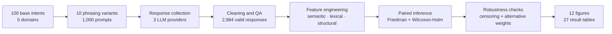
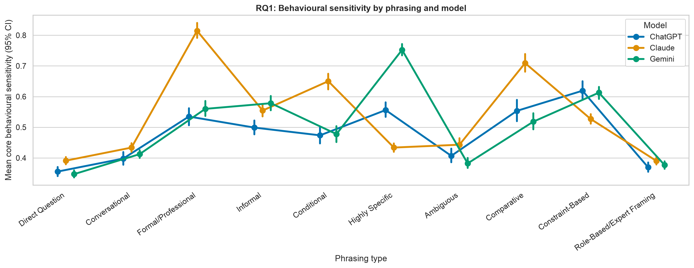
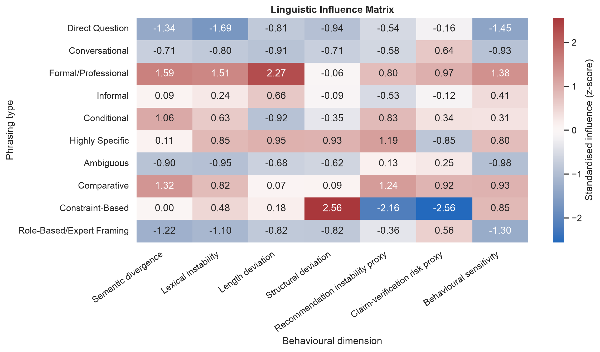
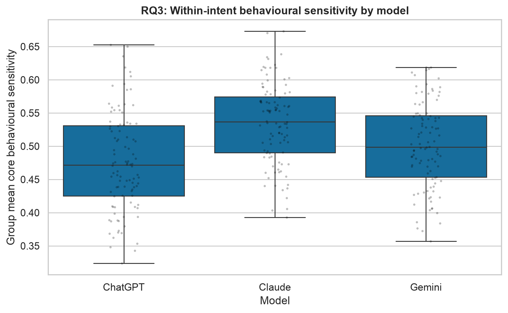
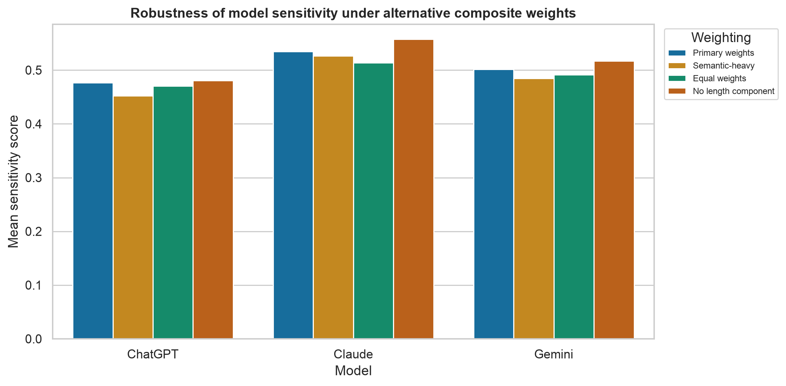

# The Linguistic Influence Matrix


> An end-to-end empirical study of how semantically equivalent prompt wording changes the behaviour of ChatGPT, Claude, and Gemini.

This repository contains the complete dissertation workflow: experimental prompt design, multi-provider response collection, quality-controlled data preparation, transparent NLP feature engineering, paired statistical testing, robustness analysis, and publication-ready outputs.

## Study at a glance

| Component | Scope |
|---|---:|
| Conversational LLMs | ChatGPT, Claude, Gemini |
| Prompt variants | 1,000 |
| Base intents | 100 |
| Phrasing conditions | 10 |
| Domains | 5 |
| Expected prompt-model responses | 3,000 |
| Observed valid responses | 2,984 (99.47%) |
| Responses at the 1,200-token ceiling | 694 |
| Publication-ready figures | 12 |

The five domains are Technology, Finance, Healthcare, Marketing, and Sports. The analysis retains capped responses as realised experimental outputs and includes matched-prompt and uncapped-only robustness checks.

## Research questions

1. How do semantically equivalent linguistic prompt variations influence behavioural consistency in LLM-generated responses?
2. Which prompt structures most strongly affect semantic divergence, claim-verification risk, and recommendation drift?
3. How does wording-induced behavioural drift differ across conversational LLMs?

## End-to-end pipeline



Each stage is implemented as a numbered Colab notebook and passes a versioned artifact to the next stage.

## Key findings

- Prompt phrasing produced statistically significant behavioural differences for every model. For the core sensitivity score, effect sizes were substantial: Kendall's W = 0.497 for ChatGPT, 0.736 for Claude, and 0.676 for Gemini.
- Formal/Professional phrasing had the highest descriptive mean core sensitivity (0.636) and latent-semantic divergence (0.201) across the observed dataset.
- Model-level within-intent sensitivity differed significantly, χ²(2) = 90.98, p < .001, Kendall's W = 0.455.
- Collection conditions matter: ChatGPT reached the 1,200-token ceiling far more often than the other models. The repository therefore reports full-observed, uncapped-only, matched-prompt, and alternative-weight analyses.

Automated claim-risk and recommendation measures are explicitly treated as **proxies**, not verified hallucination or factuality labels. See the [methodology](docs/METHODOLOGY.md) and [validation protocol](results/manual_validation/manual_validation_protocol.md).

## Repository structure

```text
.
├── assets/readme/          # README hero artwork
├── data/
│   ├── raw/                # Collected provider responses
│   ├── interim/            # Prompt design workbook
│   └── processed/          # Analysis-ready dataset
├── notebooks/              # 01 collection → 02 cleaning → 03 analysis
├── results/
│   ├── figures/            # 12 publication-ready PNG figures
│   ├── tables/             # Data quality, RQ1–RQ3, robustness, matrix tables
│   └── manual_validation/  # Validation sample and coding protocol
├── scripts/                # Reproduction and repository validation helpers
├── docs/                   # Method and design documentation
└── .github/workflows/      # Automated repository integrity check
```

## Reproduce the analysis
The statistical analysis is fully local and does not require API keys.

```bash
python3 -m venv .venv
source .venv/bin/activate
pip install -r requirements.txt
./scripts/run_analysis.sh
python scripts/validate_project.py
```

The run reads `data/processed/analysis_ready_responses.csv` and recreates `results/`. Random procedures use seed 42. To rerun response collection, use the provider secrets documented inside Notebook 01; never commit API keys.

## Notebooks

| Stage | Notebook | Purpose |
|---|---|---|
| 01 | [Collect LLM responses](notebooks/01_collect_llm_responses.ipynb) | Builds a resumable 3-provider collection with model fallback, checkpoints, and provenance |
| 02 | [Prepare and clean data](notebooks/02_prepare_and_clean_data_colab.ipynb) | Reshapes the workbook, validates the design, flags collection limitations, and exports analysis-ready data |
| 03 | [Comprehensive analysis](notebooks/03_comprehensive_dissertation_analysis_colab.ipynb) | Engineers measures, answers RQ1–RQ3, tests robustness, and generates every table and figure |

All three notebooks are Google Colab compatible. The first stage can incur provider API costs; Stages 02 and 03 operate on included files.

## Selected outputs

| Behavioural sensitivity | Linguistic Influence Matrix |
|---|---|
|  |  |

| Model comparison | Robustness to alternative weights |
|---|---|
|  |  |

Browse the complete [results index](results/README.md) or the generated [results and write-up guide](results/RESULTS_AND_WRITEUP_GUIDE.md).

## Statistical design

- Transparent NLP measures: TF-IDF/LSA semantic distance, lexical Jaccard instability, length deviation, structural deviation, recommendation extraction, and rule-based claim-risk scoring.
- Paired omnibus tests: Friedman tests using base intents as blocks.
- Post-hoc inference: paired Wilcoxon signed-rank tests with Holm correction and rank-biserial effect sizes.
- Robustness: uncapped-only samples, common-prompt comparisons, and alternative composite weightings.
- Reproducibility: fixed random seed, complete intermediate measures, machine-readable summaries, and automated integrity checks.

## Responsible interpretation

This is an observational comparison under a fixed collection protocol and one response per prompt-model pair. Results should not be generalised to every model version, temperature, task, or deployment. Differential token censoring is a material limitation, and automated proxy measures require careful interpretation.

## Citation

Citation metadata is available in [CITATION.cff](CITATION.cff). If you use the repository, please cite the project and state the model versions and collection date reported in the dataset.

## Author and licence

Syed Miqdad Hamdani · Dissertation research project · 2026

Code is released under the [MIT License](LICENSE).
